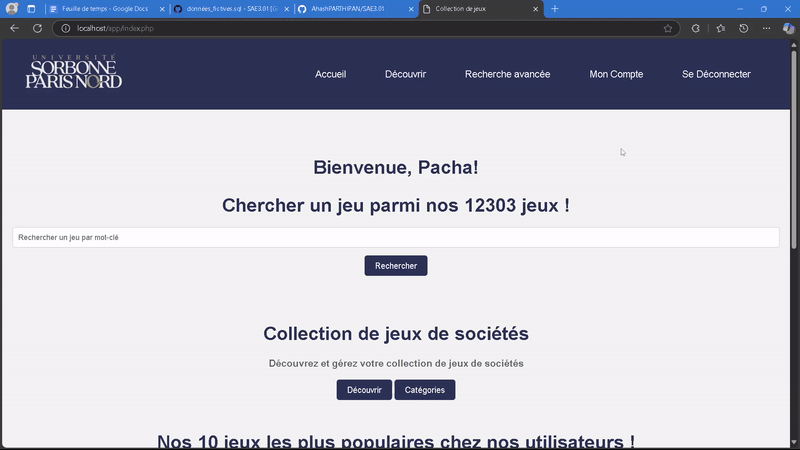

# SAE3.01: Développement d'une application

## Aperçu du projet
Voici un aperçu de l'application :



---

## Contexte
L'Université Sorbonne Paris Nord possède une collection exceptionnelle de plus de 17 000 jeux de société, certains datant du XIXe siècle. Ce projet vise à concevoir une application web accompagnée de scripts pour gérer, organiser, et valoriser cette collection.

## Fonctionnalités principales
- **Nettoyage des données** : Correction des incohérences dans les fichiers Excel.
- **Base de données relationnelle** : Organisation structurée des informations.
- **Interface web** : Recherche avancée, gestion des prêts, et gestion de l'inventaire.
- **Scripts Python** : Manipulation automatisée des données.

---

## Structure du projet
```plaintext
SAE3.01-main/
├── app/              # Site web principal (MVC)
├── sql/              # Scripts SQL pour la base de données
├── scripts/          # Scripts Python et fichiers de données
├── archive/          # Prototype initial en HTML
├── README.md         # Documentation principale
```

---

## Installation (Seules les personnes possédant l'inventaire privé pourront)

### Prérequis
1. **Logiciels nécessaires** :
   - [XAMPP](https://www.apachefriends.org/index.html) pour le serveur PHP et MySQL.
   - [Python 3.x](https://www.python.org/downloads/) et `pip` pour les scripts.
   - Navigateur web pour accéder à l'application.

2. **Environnement de base** :
   - Une version MySQL Server installée (v8.0 ou 9.1, par exemple).

---

### Étapes d'installation

#### 1. Télécharger le projet
Clonez ou téléchargez ce dépôt GitHub :
```bash
git clone https://github.com/votre_projet/SAE3.01-main.git
```
Décompressez ou placez le projet dans un répertoire local.

---

#### 2. Préparer la base de données
1. **Importer l'inventaire** :
   - Déplacez le fichier `inventaire.csv` dans le répertoire suivant (selon la version MySQL installée) :
     ```
     C:/ProgramData/MySQL/MySQL Server <VERSION>/Uploads/inventaire.csv
     ```
   - Assurez-vous que le fichier est accessible dans ce dossier.

2. **Exécuter le script de création des tables** :
   - Ouvrez votre interface de gestion MySQL (ex. phpMyAdmin ou ligne de commande).
   - Importez le fichier `sql/creation_tables.sql` dans votre base de données.
   - **Remarque importante** : Modifiez la localisation du fichier `inventaire.csv` dans le script pour refléter l'emplacement exact de votre fichier. Exemple :
     ```sql
     LOAD DATA INFILE 'C:/ProgramData/MySQL/MySQL Server 8.0/Uploads/inventaire.csv'
     INTO TABLE ...
     ```

3. **Insérer les données** :
   - Importez ensuite les scripts d'insertion `sql/script_insertion.sql`.

4. **Configurer le fichier `identifiant.php`** :
   - Ouvrez le fichier `app/identifiants/identifiant.php`.
   - Remplacez les informations par celles correspondant à votre environnement :
     ```php
     <?php

     $dsn = 'mysql:host=localhost;dbname=NomDeVotreBDD';
     $username = 'VotreNomUtilisateur';
     $password = 'VotreMotDePasse';

     ?>
     ```

---

#### 3. Configurer le serveur web
1. **Placer le projet dans le répertoire de XAMPP** :
   - Copiez le dossier `app/` dans le répertoire `htdocs` de XAMPP.
   - Par exemple : `C:/xampp/htdocs/app/`.

2. **Lancer le serveur** :
   - Démarrez Apache et MySQL dans le panneau de contrôle de XAMPP.
   - Accédez au site web en ouvrant un navigateur et en tapant :
     ```
     http://localhost/app/
     ```

---

### Scripts Python
1. Les scripts de nettoyage des données se trouvent dans le dossier `scripts/nettoyage/`.
   - **Commandes utiles** :
     ```bash
     pip install pandas
     python main.py
     ```
2. Ces scripts permettent de nettoyer et de préparer les données avant insertion.

---

## Équipe du projet
- **[Mehdi ARRAB](https://github.com/jadoothepooh/)**
- **[Lasry BESKIWIN](https://github.com/Lasryy)**
- **[Rania Bousfiha](https://github.com/rania212)**
- **[Safiya NGUYEN](https://github.com/safiya-ng)**
- **[Ahash PARTHIPAN](https://github.com/AhashPARTHIPAN)**
- **[Jules RICHARDOT](https://github.com/JulesRichardot)**

## Technologies utilisées
- **Langages** : Python, PHP, SQL
- **Base de données** : MySQL
- **Frontend** : HTML, CSS, JS
